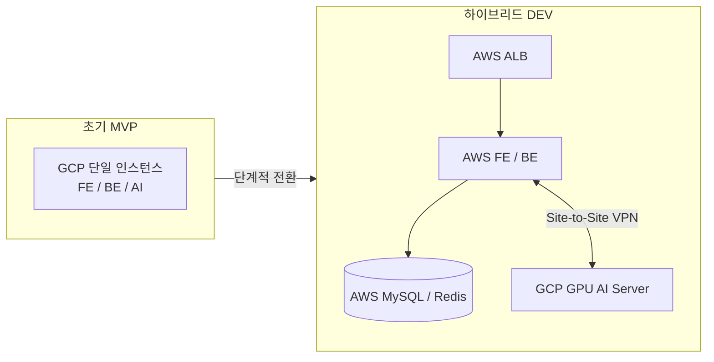
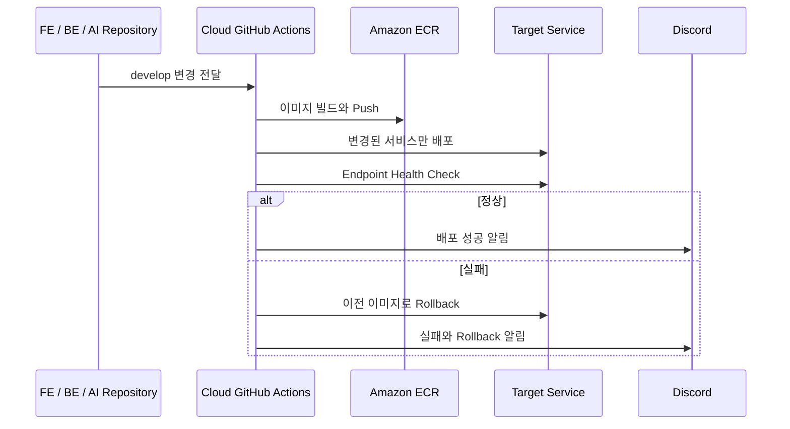

# CareerBee Cloud

> IT 구직자 대상 웹서비스의 AWS·GCP 하이브리드 개발 환경과 배포·복구·모니터링
> 자동화를 구축한 프로젝트

[Repository](https://github.com/100-hours-a-week/3-team-CareerBee-cloud) ·
[My Commits](https://github.com/100-hours-a-week/3-team-CareerBee-cloud/commits/develop/?author=j5hjun) ·
[Frontend](https://github.com/100-hours-a-week/3-team-CareerBee-fe) ·
[Backend](https://github.com/100-hours-a-week/3-team-CareerBee-be) ·
[AI](https://github.com/100-hours-a-week/3-team-CareerBee-ai)

---

## 프로젝트 정보

- 기간: 2025.03–2025.08
- 인원: 6명, 인프라 담당 2명
- 분야: Cloud · DevOps · Observability
- 역할: DEV 인프라 설계와 구축, 배포·복구·모니터링 자동화
- 핵심 결과: Private Network, 환경 생성·삭제·복원, 서비스별 자동 롤백과 통합 관측 구축
- 기술: AWS, GCP, Terraform, GitHub Actions, Docker, Nginx
- 관측: Prometheus, Grafana, Loki, Node Exporter, DCGM Exporter
- 네트워크: AWS Transit Gateway, GCP HA VPN, Tailscale

## 프로젝트 배경

CareerBee는 기업 정보, CS 문제 풀이, AI 이력서와 모의 면접 기능을 제공하는 웹서비스입니다.
Frontend, Backend와 AI 저장소가 분리되어 있었고 각 저장소의 `develop` 브랜치를 실행하는
DEV 환경과 배포 흐름이 필요했습니다.

초기에는 MVP를 빠르게 확인하기 위해 FE, BE와 AI를 하나의 GCP 인스턴스에 배포했습니다.
이후 AWS 지원 크레딧을 활용하고 GPU가 필요한 AI 서버는 GCP에 유지하기 위해 웹·데이터 계층을
AWS로 이전했습니다.

## 인프라 전환

최종 구조에서는 애플리케이션과 데이터 계층을 AWS에 두고, GPU가 필요한 AI 서버를 GCP에
유지했습니다. 두 클라우드는 Site-to-Site VPN으로 연결해 Backend와 AI 서버가 Private IP로
통신하도록 구성했습니다.

## 핵심 기여

| 문제 | 구현 | 검증 또는 결과 |
| --- | --- | --- |
| AWS와 GCP 서버의 외부 노출 | Transit Gateway와 HA VPN 연결 | Backend와 AI 서버의 Private IP 통신 |
| 중지 후에도 남는 유휴 비용 | Terraform 생성·삭제와 S3 백업·복원 | DEV 누적 비용을 PROD 대비 약 50%로 관리 |
| 한 서비스 변경 시 전체 재시작 | 서비스별 배포, 헬스 체크와 롤백 | 실패한 서비스만 이전 이미지로 복구 |
| 클라우드별로 분리된 지표와 로그 | Prometheus, Grafana, Loki 통합 | AWS·GCP·GPU 상태를 한곳에서 확인 |
| 반복되는 운영자 VPN 설정 | OpenVPN을 Tailscale로 전환 | 인증서 재배포와 전용 VPN 서버 제거 |

## 문제 해결 사례

### 1. AWS와 GCP의 Private Network 연결

**문제**

3-Tier 구조로 전환하면서 AWS의 애플리케이션·데이터 계층과 GCP AI 서버가 공개 인터넷을
거치지 않고 통신해야 했습니다.

**선택과 구현**

AWS Transit Gateway와 GCP HA VPN을 연결했습니다. 처음 적용한 GCP Terraform 모듈만으로는
Gateway, Tunnel, BGP Peer와 Route가 모두 연결되지 않아 양쪽 종점과 경로를 하나씩 확인하고
부족한 구성을 보완했습니다.

**검증과 결과**

Backend와 GCP AI 서버가 Private IP로 통신하는 것을 확인했습니다. 운영자가 서버에 접근하는
경로는 서비스 네트워크와 분리해 Tailscale을 사용했습니다.

### 2. DEV 환경 생성·삭제·복원 자동화

**문제**

EC2와 GCE를 중지해도 일부 리소스 비용이 계속 발생했습니다. 단순 중지는 사용하지 않는 시간의
비용을 충분히 줄이지 못했고, 환경을 삭제하면 데이터와 인증서 복원이 필요했습니다.

**선택과 구현**

Terraform `apply`와 `destroy` Workflow를 만들고 Lambda가 정해진 시간에 GitHub Actions를
호출하도록 구성했습니다. 삭제 전에는 MySQL 데이터, SSL 인증서와 재설정에 필요한 파일을 S3에
백업하고, 다시 생성할 때 복원했습니다.

예약 시간 밖에는 팀원이 Workflow와 아이폰 단축어로 DEV 서버를 직접 실행할 수 있도록
했습니다.

**검증과 결과**

환경을 삭제한 뒤 다시 생성해 데이터와 운영 파일이 복원되는지 확인했습니다. 프로젝트 마감
시점의 DEV 누적 인프라 비용은 PROD 대비 약 50% 수준으로 관리했습니다. 이 수치는 자동화 적용
전후의 50% 절감을 의미하지 않습니다.

### 3. Dockerfile과 배포 Workflow 중앙 관리

**문제**

FE, BE와 AI 저장소가 Dockerfile과 배포 Workflow를 각각 관리하면 공통 배포 방식을 변경할 때
여러 저장소를 함께 수정해야 했습니다.

**선택과 구현**

애플리케이션 저장소의 변경이 Cloud 저장소 Workflow를 호출하도록 구성했습니다. Cloud
저장소가 대상 저장소의 `develop` 브랜치를 Checkout하고 이미지 빌드, ECR Push, 배포와 복구를
담당하도록 책임을 옮겼습니다.

**결과**

애플리케이션 개발자는 자신의 저장소에서 인프라 배포 로직을 직접 관리하지 않고도 같은 방식으로
DEV 환경에 배포할 수 있게 됐습니다.

### 4. 서비스별 독립 배포와 자동 롤백

**문제**

초기 배포 스크립트는 한 서비스만 변경돼도 FE, BE와 AI 전체를 재시작했습니다. 이미지 빌드와
컨테이너 실행 성공만 확인해 실제 Endpoint가 정상인지 판단하지 못했습니다.

**선택과 구현**

Webhook이 전달받은 서비스만 배포하도록 변경하고 다음 순서로 실행했습니다.

1. 배포 전 직전 ECR 이미지 태그 확인
2. 변경된 서비스의 이미지 빌드와 ECR Push
3. 대상 서비스만 재배포
4. Endpoint Health Check 반복
5. 실패하면 직전 이미지로 롤백
6. 배포 결과와 GitHub Actions 로그를 Discord로 전달

**검증과 결과**

FE, BE와 AI를 독립적으로 배포하고 헬스 체크에 실패한 서비스만 이전 이미지로 복구하도록
구성했습니다. 배포 성공의 기준을 컨테이너 실행이 아니라 Endpoint 응답으로 변경했습니다.

### 5. 멀티 클라우드 모니터링 통합

**문제**

기존 Fluent Bit과 Scouter 구성으로는 AWS 서비스·DB 서버와 GCP GPU 서버의 상태와 로그를
한곳에서 확인하기 어려웠습니다.

**선택과 구현**

- Node Exporter로 AWS와 GCP 호스트 지표 수집
- DCGM Exporter로 GPU 지표 수집
- Loki로 시스템·애플리케이션 로그 통합
- Grafana Data Source와 Dashboard 자동 구성
- FE, BE, AI, DB와 운영 도구의 Health Check 통합

**결과**

호스트 지표, GPU 사용량, 애플리케이션 로그와 서비스 상태를 하나의 Grafana 환경에서 확인할
수 있도록 구성했습니다.

### 6. OpenVPN을 Tailscale로 전환

**문제**

DEV 환경을 다시 생성할 때마다 OpenVPN 인증서를 발급해 팀원에게 배포해야 했습니다. 운영자
접근만을 위해 별도 OpenVPN 서버도 유지하고 있었습니다.

**선택과 구현**

운영자 접근을 Tailscale로 전환하고 인스턴스 생성 과정에서 이전 Tailscale 상태를 복원했습니다.

**결과**

인증서 재발급과 배포 과정을 제거하고 OpenVPN 전용 서버와 관련 리소스를 삭제했습니다.

### 7. Nginx와 ALB를 통과하는 SSE 연결

**문제**

Nginx를 거친 SSE 연결에 기본 Buffering과 Timeout이 적용돼 실시간 이벤트 스트림이 유지되지
않았습니다.

**선택과 구현**

Nginx에 HTTP/1.1, 응답 Buffering 비활성화, `text/event-stream` Header와 긴 Read Timeout을
적용했습니다. ALB Idle Timeout도 SSE 연결 시간에 맞게 조정했습니다.

**결과**

Nginx와 ALB를 통과한 이후에도 이벤트 스트림 연결이 유지되는 것을 확인했습니다.

## 배포 흐름

## 검증 범위

| 범위 | 확인 내용 |
| --- | --- |
| Network | AWS와 GCP의 Tunnel, BGP, Route, Private IP 통신 |
| Lifecycle | Terraform 생성·삭제, S3 백업과 환경 복원 |
| Deployment | 서비스별 배포, Endpoint Health Check, 이전 이미지 복구 |
| Observability | AWS·GCP 호스트, GPU, 로그와 서비스 상태 수집 |
| Streaming | Nginx와 ALB를 통과하는 SSE 연결 유지 |

## 결과와 현재 범위

- AWS 애플리케이션·데이터 계층과 GCP GPU 서버를 Private Network로 연결했습니다.
- DEV 환경의 생성, 백업, 삭제와 복원을 자동화했습니다.
- 서비스별 배포와 Endpoint Health Check 기반 자동 롤백을 구현했습니다.
- AWS, GCP, GPU 지표와 애플리케이션 로그를 Grafana에 통합했습니다.
- Tailscale 전환으로 OpenVPN 인증서 배포와 전용 서버 운영을 제거했습니다.

이 포트폴리오는 CareerBee의 DEV 환경에서 담당한 범위를 설명합니다. PROD 전체 운영이나 실제
사용자 트래픽에 대한 가용성 결과로 확대해 표현하지 않습니다. 비용 결과도 PROD 대비 DEV 누적
비용의 비율이며, 자동화 도입 전후의 절감률과 구분합니다.

---

[← 포트폴리오 인덱스로 돌아가기](../README.md)
