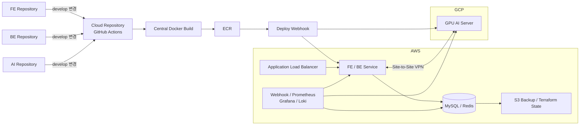

# CareerBee Cloud

> IT 구직자를 위한 웹서비스의 DEV 환경을 담당하며 AWS·GCP 하이브리드 인프라,
> 배포 자동화와 관측 환경을 구축했습니다.

[Repository](https://github.com/100-hours-a-week/3-team-CareerBee-cloud)
· [My Commits](https://github.com/100-hours-a-week/3-team-CareerBee-cloud/commits/develop/?author=j5hjun)
· [Frontend](https://github.com/100-hours-a-week/3-team-CareerBee-fe)
· [Backend](https://github.com/100-hours-a-week/3-team-CareerBee-be)
· [AI](https://github.com/100-hours-a-week/3-team-CareerBee-ai)

---

## 프로젝트 정보

- 기간: 2025.03–2025.08
- 인원: 6명
- 역할: Cloud Engineer, DevOps
- 담당: DEV 인프라 설계·구축, 배포와 운영 자동화
- 기술: AWS, GCP, Terraform, GitHub Actions, Docker
- 관측: Prometheus, Grafana, Loki, Node Exporter, DCGM Exporter
- 네트워크: AWS Transit Gateway, GCP HA VPN, Tailscale

## 프로젝트 배경

CareerBee는 기업 정보와 CS 문제 풀이, AI 이력서와 모의 면접 기능을 제공하는
IT 구직자 대상 웹서비스입니다.

애플리케이션은 FE·BE·AI 저장소로 분리되어 있었으며 `main`, `develop`, `feature`
브랜치 전략을 사용했습니다. 저는 각 저장소의 `develop` 브랜치 코드를 실행하는
DEV 환경과 배포 흐름을 담당했습니다.

초기에는 MVP를 빠르게 제공하기 위해 모든 서비스를 하나의 GCP 인스턴스에 배포했습니다.
이후 애플리케이션과 데이터 계층을 AWS로 이전하고, GPU가 필요한 AI 서버는 GCP에
유지하면서 DEV 환경을 3-Tier 하이브리드 구조로 전환했습니다.

## 시스템 구조

- 서비스 간 통신은 AWS Site-to-Site VPN과 GCP HA VPN으로 연결했습니다.
- 운영자 접근은 Tailscale을 사용했습니다.
- Dockerfile과 이미지 빌드·배포 Workflow는 Cloud 저장소에서 중앙 관리했습니다.

## 주요 문제 해결

### 빠른 MVP 배포와 단계적 인프라 전환

초기에는 제한된 기간 안에 MVP를 제공해야 했습니다. GCP 인스턴스의 네트워크,
애플리케이션 환경 구성, 배포와 백업 과정을 스크립트로 자동화해 FE·BE·AI를 하나의
인스턴스에서 빠르게 실행할 수 있도록 구성했습니다.

이후 AWS 지원 크레딧과 GCP GPU 환경을 함께 활용하기 위해 웹·데이터 계층은 AWS로
이전하고 AI 서버는 GCP에 유지했습니다. 빅뱅 배포에서 역할이 분리된 하이브리드
DEV 환경으로 단계적으로 전환했습니다.

### AWS·GCP Private Network 연결

3-Tier 구조로 전환하면서 공개 인터넷에 있던 서버를 Private Network로 분리해야
했습니다. AWS의 애플리케이션·데이터 계층과 GCP AI 서버가 외부 노출 없이 통신할 수
있도록 Transit Gateway와 GCP HA VPN을 연결했습니다.

초기에는 GCP에서 제공하는 Terraform 오픈소스 모듈을 사용했지만, 두 클라우드의
Gateway·Tunnel·BGP Peer·Route가 완전하게 연결되지 않았습니다. 양쪽 연결 종점과
Route를 하나씩 확인하고 부족한 구성을 직접 보완해 Site-to-Site VPN 연결을
완료했습니다.

이를 통해 Backend와 GCP AI 서버가 Private IP를 이용해 통신하도록 구성했습니다.

### DEV 환경 삭제·복원 자동화

EC2와 GCE를 중지해도 일부 리소스 비용이 계속 부과됐기 때문에 단순 중지 방식으로는
유휴 비용을 충분히 줄일 수 없었습니다.

Terraform `apply`와 `destroy` Workflow를 구성하고, Lambda가 정해진 시간에 GitHub
Actions를 호출하도록 구현해 출퇴근 시간에 맞춰 DEV 환경을 생성·삭제했습니다.

환경 삭제 전에는 MySQL 데이터, SSL 인증서와 서버 재설정에 필요한 운영 파일을 S3에
백업했습니다. 환경을 다시 생성할 때 이를 복원해 삭제 전의 개발 상태를 유지했습니다.

예약 시간 외에도 팀원이 환경을 사용할 수 있도록 Workflow를 수동 실행할 수 있게
했으며, 아이폰 단축어를 통해 팀원이 직접 DEV 서버를 켤 수 있도록 구성했습니다.

프로젝트 마감 시점의 누적 DEV 인프라 비용을 PROD 대비 약 50% 수준으로 관리했습니다.

### OpenVPN을 Tailscale로 전환

DEV 환경을 삭제하고 다시 생성할 때마다 OpenVPN 인증서를 재발급하고 팀원에게 배포해야
했습니다. 또한 운영자 접근만을 위해 별도의 OpenVPN 서버를 유지해야 했습니다.

운영자 접근 방식을 Tailscale로 전환하고, 인스턴스 생성 과정에서 이전 Tailscale
상태를 복원하도록 구성했습니다. 이를 통해 인증서를 반복해서 발급하는 과정을 제거하고
OpenVPN 전용 서버와 관련 리소스를 삭제했습니다.

### Dockerfile과 배포 Workflow 중앙 관리

각 애플리케이션 저장소에서 Dockerfile과 배포 Workflow를 따로 관리하면 공통 배포
방식을 변경할 때 여러 저장소를 함께 수정해야 했습니다.

FE·BE·AI 저장소의 변경이 Cloud 저장소의 Workflow를 호출하도록 구성하고, Cloud
저장소가 각 저장소의 `develop` 브랜치를 Checkout해 이미지를 빌드하도록 변경했습니다.

Dockerfile, ECR Push, 배포와 복구 로직을 Cloud 저장소에서 중앙 관리하면서
애플리케이션 코드와 인프라 배포 책임을 분리했습니다.

### 서비스별 독립 배포와 자동 Rollback

초기 배포 스크립트는 하나의 서비스만 변경돼도 FE·BE·AI 전체를 재시작했습니다.
또한 이미지 빌드와 컨테이너 실행 성공만으로는 서비스가 정상이라고 판단할 수
없었습니다.

Webhook이 전달받은 서비스만 배포하도록 수정하고 다음 흐름을 구성했습니다.

1. 배포 전 직전 ECR 이미지 태그 확보
2. 변경된 서비스의 Docker 이미지 빌드와 ECR Push
3. 대상 서비스만 재배포
4. Endpoint Health Check 반복
5. 실패 시 직전 이미지로 Rollback
6. 배포 결과와 GitHub Actions 로그를 Discord로 전달

이를 통해 FE·BE·AI를 독립적으로 배포하고 실패한 서비스만 이전 버전으로 복구할 수
있도록 구성했습니다.

### 멀티 클라우드 관측 환경 중앙화

초기 Fluent Bit·Scouter 구성으로는 AWS 서비스·DB 서버와 GCP GPU 서버의 상태와
로그를 한곳에서 확인하기 어려웠습니다.

Prometheus, Grafana와 Loki를 중심으로 관측 환경을 재구성했습니다.

- Node Exporter를 이용한 AWS·GCP 호스트 지표 수집
- DCGM Exporter를 이용한 GPU 지표 수집
- Loki를 이용한 시스템·애플리케이션 로그 통합
- Grafana Data Source와 Dashboard 자동 구성
- FE·BE·AI·DB·운영 도구의 Health Check 통합

AWS와 GCP의 시스템 지표, GPU 사용량과 애플리케이션 로그를 Grafana에서 함께
확인할 수 있도록 구성했습니다.

### SSE 연결 문제 해결

Nginx를 거친 SSE 연결이 정상적으로 유지되지 않는 문제가 있었습니다. 일반 HTTP
요청과 달리 SSE는 연결을 종료하지 않고 응답을 계속 전달해야 하지만 Nginx의 기본
Buffering과 Timeout 설정이 적용되고 있었습니다.

Nginx에 HTTP/1.1, 응답 Buffering 비활성화, `text/event-stream` Header와 긴 Read
Timeout을 설정했습니다. 이후 ALB의 Idle Timeout도 조정해 실시간 이벤트 스트림
연결이 유지되도록 해결했습니다.

## 결과

- AWS 애플리케이션·데이터 계층과 GCP GPU 서버를 Private Network로 연결했습니다.
- DEV 환경의 생성·백업·삭제·복원을 자동화하고 팀원이 직접 제어할 수 있도록 했습니다.
- 프로젝트 마감 시점의 누적 DEV 인프라 비용을 PROD 대비 약 50% 수준으로 관리했습니다.
- Dockerfile과 배포 Workflow를 Cloud 저장소에서 중앙 관리했습니다.
- FE·BE·AI의 독립 배포와 Health Check 기반 자동 Rollback을 구현했습니다.
- AWS·GCP의 시스템 지표, GPU 사용량과 로그를 하나의 Grafana 환경으로 통합했습니다.
- Nginx와 ALB 설정을 조정해 SSE 연결 문제를 해결했습니다.

## 배운 점

이미지 빌드와 컨테이너 실행이 성공해도 실제 서비스가 정상이라는 보장은 없었습니다.
Endpoint Health Check로 배포 결과를 판단하고, 실패 시 이전 ECR 이미지로
Rollback하도록 구성하면서 배포 자동화에는 실패를 감지하고 복구하는 과정까지
포함되어야 한다는 점을 배웠습니다.

OpenVPN은 DEV 환경을 다시 생성할 때마다 인증서를 재발급하고 팀원에게 배포해야 하는
불편함이 있었습니다. Tailscale로 전환해 기존 접속 상태를 복원하고 전용 VPN 서버를
제거하면서, 인프라 구조를 설계할 때는 기술적 연결뿐 아니라 이를 사용하는 개발자의
접근 과정과 운영 부담도 함께 고려해야 한다는 점을 배웠습니다.

각 애플리케이션 저장소에서 Dockerfile과 배포 Workflow를 관리하면 공통 배포 방식을
변경할 때 여러 저장소를 함께 수정해야 했습니다. 이를 Cloud 저장소로 중앙화하면서
FE·BE·AI 개발자가 자신의 저장소에서 인프라 설정을 직접 관리하지 않아도 동일한
방식으로 빌드·배포할 수 있었습니다. 공통 관심사를 한곳에서 관리하면 개발자의
개입을 줄이면서도 팀 전체의 배포 방식을 일관되게 유지할 수 있다는 점을 배웠습니다.

---

[← 포트폴리오 인덱스로 돌아가기](../README.md)
