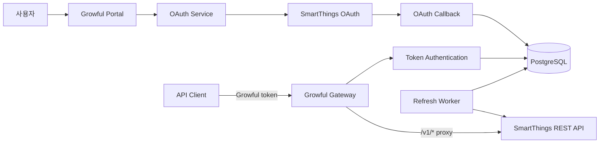

# Growful SmartThings Gateway

> SmartThings OAuth 인증부터 토큰 저장, API 프록시와 연결 해제까지 설계·구현하고
> private beta로 배포한 인증 게이트웨이

[Repository](https://github.com/j5hjun/growful) ·
[Service](https://smartthings.growful.click) ·
[My Pull Requests](https://github.com/j5hjun/growful/pulls?q=is%3Apr+author%3Aj5hjun)

---

## 프로젝트 정보

- 기간: 2026.07
- 형태: 개인 프로젝트
- 분야: Backend · Integration · DevOps
- 역할: 백엔드 설계와 구현, OAuth 연동, 테스트, private beta 배포
- 핵심 결과: OAuth 전체 흐름, 토큰 암호화·교체, `/v1/*` 프록시와 계층별 자동화 테스트 구축
- 기술: TypeScript, Node.js 24, Fastify, PostgreSQL, Kysely, Zod
- 테스트: Vitest, Playwright
- 배포: Docker Compose, GitHub Actions, Cloudflare, Tailscale
- 상태: Private beta

## 프로젝트 배경

SmartThings API를 사용하려면 사용자가 OAuth 권한을 승인하고, 서비스는 access token과
refresh token을 안전하게 보관해야 합니다. 토큰 갱신, 연결 해제와 여러 사용자 연결을 직접
처리하지 않으면 다른 애플리케이션에서 SmartThings API를 일관된 방식으로 사용하기
어렵습니다.

Growful SmartThings Gateway는 OAuth 연결과 토큰 수명 주기를 한곳에서 관리합니다. 사용자는
OAuth 연결을 마친 뒤 한 번만 표시되는 Growful 토큰을 발급받고, 기존 SmartThings REST API와
같은 `/v1/*` 경로를 호출합니다. Gateway는 Growful 토큰으로 연결을 식별하고 암호화된
SmartThings 토큰을 이용해 요청을 전달합니다.

## 담당 범위

- OAuth 시작, callback, 연결 조회, 토큰 교체와 연결 해제 API 구현
- OAuth state, 요청 scope와 연결 정보를 저장하는 PostgreSQL 스키마 구성
- SmartThings access token과 refresh token 암호화
- Growful 토큰 발급, 검증, 교체와 폐기
- `/v1/*` API 프록시와 연결별 요청 제한 구현
- 토큰 갱신 worker와 여러 인스턴스의 중복 갱신 방지
- Unit, Integration, E2E, Browser 테스트 구성
- Docker Compose와 GitHub Actions 기반 private beta 배포

## 시스템 구조

- SmartThings 토큰은 Gateway 밖으로 전달하지 않습니다.
- 사용자는 원문이 한 번만 표시되는 Growful 토큰으로 연결을 선택합니다.
- 프록시는 요청 메서드, 경로, 쿼리와 본문을 같은 SmartThings API로 전달합니다.
- 토큰 갱신 상태와 요청 제한 정보는 PostgreSQL에서 인스턴스 간 공유합니다.

## 주요 문제 해결

### OAuth state와 토큰 원문 보호

OAuth callback을 검증하려면 요청 시점의 state를 보관해야 하지만, 원문을 그대로 저장하면
데이터베이스 노출 시 재사용될 수 있습니다. SmartThings 토큰과 사용자가 API 호출에 사용하는
Growful 토큰도 같은 저장 방식을 사용할 수 없었습니다.

OAuth state는 SHA-256 해시만 저장하고 callback에서 한 번 소비하도록 구성했습니다. state는
10분 뒤 만료되며 요청한 scope도 함께 삭제됩니다. SmartThings access token과 refresh token은
AES-256-GCM으로 암호화하고, Growful 토큰은 OAuth 완료 화면에서 한 번만 제공한 뒤 해시만
저장합니다.

연결 상태 API와 애플리케이션 로그에는 토큰, client secret과 OAuth code가 포함되지 않도록
응답과 오류 경계를 분리했습니다.

### 기존 API 호출 방식을 유지하는 프록시

Gateway 전용 API 형식을 새로 정의하면 SmartThings를 사용하던 클라이언트가 경로와 요청 모델을
다시 구현해야 합니다.

`GET`, `POST`, `PUT`, `PATCH`, `DELETE`, `HEAD`, `OPTIONS`의 `/v1/*` 요청을 받아 메서드,
경로, 쿼리와 본문을 같은 SmartThings API로 전달하도록 구성했습니다. 리다이렉트는 따라가지
않고, 전송 과정에서 다시 계산해야 하는 헤더를 제외한 상태 코드와 응답을 반환합니다.

클라이언트는 SmartThings REST API의 호출 형태를 유지하면서 인증 토큰만 Growful 토큰으로
교체할 수 있습니다.

### 요청 제한과 upstream backoff 공유

여러 Gateway 인스턴스가 각자 요청 횟수를 계산하면 하나의 연결이 전체 제한을 초과할 수
있습니다. SmartThings가 `429`를 반환한 뒤 다른 인스턴스가 곧바로 요청을 다시 보내는 문제도
막아야 했습니다.

연결별 60초 요청 창과 허용 건수를 PostgreSQL에서 원자적으로 갱신했습니다. SmartThings가
`429`와 `Retry-After`를 반환하면 연결별 대기 마감을 저장하고, 해당 시각까지 후속 요청을
upstream으로 전달하지 않습니다.

요청 제한과 backoff 상태를 데이터베이스에 저장해 여러 인스턴스가 같은 기준을 사용하도록
구성했습니다.

### 중복 토큰 갱신 방지

여러 worker가 같은 refresh token을 동시에 사용하면 일회용 refresh token이 소진되거나 새 토큰
저장이 충돌할 수 있습니다.

PostgreSQL에 갱신 임대 정보를 저장해 하나의 worker만 연결을 갱신하도록 했습니다. 토큰 교환은
자동 재시도하지 않고, 갱신 결과와 다음 만료 시각을 같은 연결 상태에 반영했습니다.

### 배포와 롤백 호환성 검증

애플리케이션 테스트가 통과해도 새 이미지가 기존 데이터베이스에서 실행되지 않거나, 롤백한
이전 이미지가 변경된 스키마와 호환되지 않을 수 있습니다.

GitHub Actions에서 lint, typecheck, Unit, Integration, E2E와 Browser 테스트를 분리해
실행합니다. 배포 전에는 환경 변수, 파일 권한과 Docker Compose 설정을 확인하고, 이전
`main` 이미지와 후보 이미지를 같은 데이터베이스에서 차례로 실행하는 version-skew smoke
test로 롤백 호환성을 검증합니다.

배포 서버 접근은 Tailscale SSH로 제한하고, health와 readiness를 분리해 프로세스 상태와
PostgreSQL·감사 체인 상태를 각각 확인하도록 구성했습니다.

## 검증

| 범위 | 확인 내용 |
| --- | --- |
| Unit | OAuth service, 토큰 암호화와 검증, scope 정책, 요청 제한 |
| Integration | PostgreSQL 저장소, 갱신 임대, 감사 이벤트, 초대와 삭제 흐름 |
| E2E | OAuth 보안, API 프록시, 오류 응답, rate limit과 webhook |
| Browser | OAuth 결과 화면, 권한 선택, 관리 화면과 접근성 |
| Deployment | preflight, Docker Compose 보안 설정, smoke test, 롤백 호환성 |

[Gateway README](https://github.com/j5hjun/growful/blob/main/packages/smartthings-gateway/README.md) ·
[Tests](https://github.com/j5hjun/growful/tree/main/packages/smartthings-gateway/tests) ·
[Deployment](https://github.com/j5hjun/growful/tree/main/deploy/smartthings-gateway)

## 결과

- OAuth 연결, 토큰 교체와 연결 해제를 하나의 private beta 웹 흐름으로 제공했습니다.
- SmartThings 토큰 원문을 외부에 전달하지 않는 인증 경계를 구성했습니다.
- 기존 SmartThings REST API 호출 형태를 유지하는 `/v1/*` 프록시를 구현했습니다.
- Unit, Integration, E2E, Browser와 배포 검증을 분리했습니다.
- 기능과 수정 작업을 독립 PR로 진행하고 개발 PR 29건을 `main`에 병합했습니다.

## 현재 한계

현재 서비스는 초대된 사용자만 이용할 수 있는 private beta입니다. 공개 가입과 상업적 이용에
필요한 SmartThings 승인, 운영 주체와 지원 절차, 법률 검토는 완료된 상태로 표현하지 않습니다.
애플리케이션의 토큰 처리와 primary PostgreSQL 삭제 흐름은 테스트했지만, 실제 운영 환경의
로그·백업·WAL·스냅샷 보존과 파기 증빙은 별도 검증이 필요합니다.

이 범위를 코드와 문서에서 구분해, 구현한 통제와 아직 운영 증빙이 필요한 항목을 같은 수준의
완료 상태로 주장하지 않도록 관리하고 있습니다.

---

[← 포트폴리오 인덱스로 돌아가기](../README.md)
