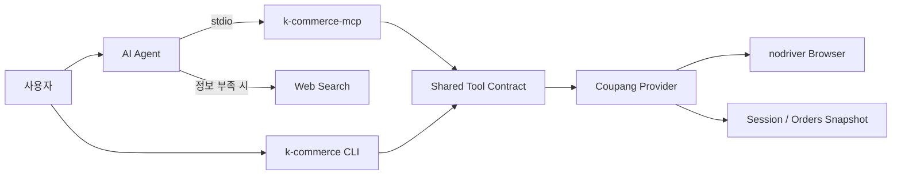

# K-Commerce

> 21개 커머스 도구가 CLI와 MCP에서 같은 요청·응답 계약을 사용하도록 통합한
> 로컬 자동화 프로젝트

[Repository](https://github.com/j5hjun/k-commerce) ·
[README](https://github.com/j5hjun/k-commerce/blob/dev/README.ko.md) ·
[My Pull Requests](https://github.com/j5hjun/k-commerce/pulls?q=is%3Apr+author%3Aj5hjun)

---

## 프로젝트 정보

- 기간: 2026.06–2026.07
- 인원: 3명
- 분야: AI Agent · Backend · Automation
- 역할: 공통 도구 계약, 로그인과 세션, 주문·상품 자동화, Python 패키지 배포
- 핵심 결과: 팀이 구현한 21개 도구의 CLI·MCP 실행 구조와 요청·응답 계약 통합
- 기술: Python, FastMCP, FastAPI, LangChain, nodriver, pytest, uv
- 상태: Alpha
- 라이선스: MIT

## 프로젝트 배경

온라인에서 구매한 상품의 크기나 재질을 다시 확인하려면 주문 목록에서 상품을 찾고 상세
페이지를 열어 필요한 정보가 있는 위치까지 직접 탐색해야 합니다. 정보가 상세 이미지에만
있으면 화면을 스크롤하며 내용을 확인해야 합니다.

K-Commerce는 이 과정을 다음과 같은 자연어 요청으로 처리하기 위해 시작했습니다.

> 최근에 구매한 가방걸이의 크기를 알려줘.

에이전트는 주문 내역에서 상품을 찾고, 상품 정보와 상세 이미지의 OCR 텍스트를 확인합니다.
도구가 충분한 정보를 제공하지 못하면 에이전트가 웹 조사를 통해 답을 보완할 수 있습니다.

## 핵심 기여

| 문제 | 구현 | 검증 또는 결과 |
| --- | --- | --- |
| CLI와 MCP의 도구 정의 불일치 위험 | Canonical Tool Registry와 공통 실행 경로 구성 | 21개 도구의 이름과 요청 계약 일치 검증 |
| 독립된 도구 호출 사이에서 로그인 상태 단절 | 세션 복원, 자동 로그인과 수동 로그인 전환 | 실제 계정으로 반복 호출 확인 |
| 여러 페이지 주문 수집 중 일부 요청 실패 | 페이지별 재시도, 캐시와 스냅샷 비교 | 실제 주문 내역과 수집 결과 대조 |
| 상세 이미지에만 있는 상품 정보 | 이미지 수집과 OCR 결과 구조화 | 상품 상세 도구의 결과에 정보와 OCR 텍스트 제공 |
| 정식 배포 전 설치 흐름 검증 필요 | TestPyPI와 PyPI 배포 분리 | 빌드, 설치, Entry Point와 MCP 초기화 확인 |

## 시스템 구조

- CLI와 MCP는 같은 Tool Registry와 요청 모델을 사용합니다.
- MCP는 자동화 로직을 다시 구현하지 않고 공통 실행 계층을 호출합니다.
- 로그인 세션과 주문 스냅샷은 로컬에 저장해 다음 도구 호출에서 재사용합니다.
- Provider 경계 밖의 CLI와 MCP는 특정 커머스 자동화 구현을 직접 호출하지 않습니다.

## 문제 해결 사례

### 1. CLI와 MCP의 도구 계약 통합

**문제**

도구를 CLI와 MCP에 각각 등록하면 기능이 늘어날수록 도구 이름, 입력 필드와 응답 형태가
달라질 수 있었습니다. 같은 기능인데 실행 경로에 따라 다른 요청 모델을 사용하면 테스트와
유지보수 범위도 두 배로 늘어납니다.

**선택과 구현**

Canonical Tool Registry, 공통 요청 모델과 `invoke_tool()`을 구성했습니다. CLI와 MCP는
자신의 입력을 같은 요청 모델로 변환한 뒤 하나의 실행 경로를 호출합니다.

**검증과 결과**

Integration test에서 CLI와 MCP가 노출하는 도구 목록을 비교하고, 21개 도구가 같은 요청 계약을
사용하는지 확인했습니다. 도구 구현을 한곳에 두면서 실행 채널별 차이는 입력과 출력 경계로
제한했습니다.

### 2. 브라우저 로그인 상태 유지

**문제**

MCP 도구 호출은 서로 독립적이지만 주문과 상품 정보를 조회하려면 로그인 상태가 필요했습니다.
호출마다 로그인하면 실행 시간이 늘어나고 인증 실패 가능성도 높아집니다.

**선택과 구현**

로그인은 저장된 브라우저 세션 복원, 저장된 인증 정보를 이용한 자동 로그인, 브라우저에서의
수동 로그인 순서로 시도합니다. Provider별 Credentials, Cookie, Browser Profile과 Metadata
저장 경로를 통합했습니다.

**검증과 결과**

임시 로컬 상태를 사용하는 E2E test와 실제 브라우저·계정을 사용하는 Smoke test를 분리했습니다.
한 번 로그인한 뒤 이어지는 도구 호출에서 세션을 재사용하고, 자동 로그인이 불가능할 때 수동
로그인으로 전환되는 흐름을 확인했습니다.

### 3. 주문 수집과 데이터 정합성

**문제**

주문 내역은 여러 페이지에 걸쳐 있고 브라우저 자동화 중 일부 페이지 수집이 실패할 수
있었습니다. 일부 주문만 저장된 상태를 정상 결과로 취급하면 이후 상품 검색도 잘못된 데이터를
사용하게 됩니다.

**선택과 구현**

페이지별 실패 재시도와 캐시 재사용을 구현했습니다. 수집 결과는 로컬 스냅샷으로 저장하고,
기존 데이터와 새 데이터의 차이를 확인할 수 있도록 했습니다.

**검증과 결과**

실제 계정의 주문 내역과 수집 결과를 직접 대조했습니다. 주문 데이터뿐 아니라 주문 정보로 만든
상품 URL도 실제 상세 페이지와 일치하는지 확인했습니다.

### 4. 상세 이미지의 OCR 수집

**문제**

상품의 크기와 재질이 기본 상품 데이터가 아니라 상세 설명 이미지에만 표시되는 경우가
있었습니다.

**선택과 구현**

상품 상세 도구가 상품 정보, 상세 이미지와 이미지의 OCR 텍스트를 하나의 구조화된 결과로
제공하도록 구현했습니다.

**검증과 결과**

에이전트는 주문 내역에서 상품을 찾은 뒤 상품 정보와 OCR 결과를 함께 확인할 수 있습니다.
필요한 정보가 결과에 없을 때만 웹 조사를 사용하도록 도구와 에이전트의 책임을 나눴습니다.

### 5. Provider 확장을 고려한 책임 분리

**문제**

CLI 명령이 쿠팡 자동화 구현을 직접 호출하면 새로운 커머스 서비스를 추가할 때 CLI와 MCP
코드를 함께 수정해야 합니다.

**선택과 구현**

Provider Protocol과 Registry를 구성하고 Provider, Service, Store, Browser의 책임을
분리했습니다. CLI와 MCP는 공통 도구 계약만 알고, 실제 자동화는 선택된 Provider가 담당합니다.

**결과**

현재 Provider는 쿠팡 하나이지만, 공통 계약을 바꾸지 않고 다른 커머스 Provider를 추가할 수
있는 경계를 마련했습니다. 확장 가능성을 완료된 다중 Provider 지원으로 표현하지 않고 현재
구조의 범위로 구분했습니다.

### 6. TestPyPI와 PyPI 배포 분리

**문제**

CLI와 MCP를 외부에서 설치해 사용하려면 정식 배포 전에 패키지 구성과 Entry Point가 정상적으로
동작하는지 확인할 단계가 필요했습니다.

**선택과 구현**

CLI와 MCP 실행 파일을 하나의 Python 패키지로 구성하고 브랜치에 따라 배포 대상을 나눴습니다.

- `dev`: TestPyPI에서 빌드, 설치와 실행 흐름 확인
- `main`: PyPI 정식 배포

**검증과 결과**

Package test에서 패키지 빌드와 설치, CLI·MCP Entry Point, MCP 서버 초기화를 확인했습니다.
테스트 배포를 통과한 변경만 정식 패키지로 배포할 수 있는 흐름을 만들었습니다.

## 검증 범위

| 단계 | 확인 내용 |
| --- | --- |
| Unit | 요청 모델, Registry, Service, Store, Provider |
| Integration | CLI와 MCP wiring, 도구 목록과 요청 계약 |
| E2E | 임시 로컬 상태를 이용한 로그인과 Provider 흐름 |
| Smoke | 실제 브라우저와 계정을 이용한 주문·상품 수집 |
| Package | 빌드, 설치, CLI·MCP Entry Point, MCP 초기화 |

[Tests](https://github.com/j5hjun/k-commerce/tree/dev/packages) ·
[TestPyPI](https://test.pypi.org/project/k-commerce/)

## 결과와 현재 범위

- 쿠팡의 인증, 주문, 상품, 장바구니와 리뷰 작업을 21개 도구로 제공했습니다.
- 팀이 구현한 도구를 CLI와 MCP가 공유하는 하나의 실행 계약으로 통합했습니다.
- 로그인 상태 복원, 수집 실패 재시도와 실제 계정 데이터 검증을 자동화 흐름에 포함했습니다.
- CLI와 MCP를 하나의 Python 패키지로 배포했습니다.

프로젝트 상태는 Alpha이며 현재 지원 Provider는 쿠팡입니다. 실제 계정과 브라우저를 사용하는
Smoke test는 계정 상태와 서비스 화면 변경의 영향을 받습니다. 따라서 패키지 배포와 테스트
통과를 상용 서비스 수준의 안정성으로 표현하지 않고, 확인한 실행 범위와 제한을 함께
관리하고 있습니다.

---

[← 포트폴리오 인덱스로 돌아가기](../README.md)
