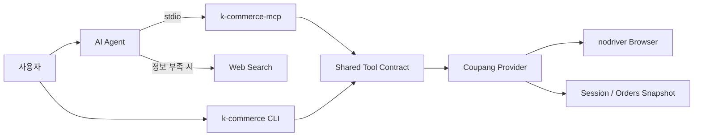

# K-Commerce

> 여러 단계를 거쳐 확인해야 하는 커머스 정보를 자연어 요청 하나로 찾을 수 있도록
> CLI와 MCP 기반 도구를 제공하는 커머스 자동화 프로젝트

[Repository](https://github.com/j5hjun/k-commerce)
· [README](https://github.com/j5hjun/k-commerce/blob/dev/README.ko.md)
· [My Pull Requests](https://github.com/j5hjun/k-commerce/pulls?q=is%3Apr+author%3Aj5hjun)

---

## 프로젝트 정보

- 기간: 2026.06–2026.07
- 인원: 3명
- 역할: 프로젝트 기반 구성, 공통 도구 계약과 핵심 자동화 기능 구현
- 기술: Python, FastMCP, FastAPI, LangChain, nodriver
- 상태: Alpha
- 라이선스: MIT

## 프로젝트 배경

온라인에서 구매한 상품의 정보를 다시 확인하려면 주문 목록을 열고, 상품을 검색하고,
상세 페이지에서 원하는 내용이 나올 때까지 직접 탐색해야 합니다.

예를 들어 최근 구매한 가방걸이의 크기를 확인하려면 주문 내역에서 상품을 찾은 뒤
상세 페이지를 열고, 크기가 표시된 위치까지 스크롤해야 합니다.

K-Commerce는 이러한 과정을 다음과 같은 자연어 요청 하나로 처리하기 위해
시작했습니다.

> 최근에 구매한 가방걸이의 크기를 알려줘.

에이전트는 주문 내역에서 해당 상품을 찾고 상품 상세 정보와 이미지의 OCR 텍스트를
확인합니다. 상품 페이지에서 필요한 정보를 찾지 못하면 웹 조사를 통해 답을 보완할 수
있도록 구성했습니다.

특정 에이전트나 커머스 서비스에 종속되지 않도록 기능을 MCP 도구로 제공하고,
Provider 경계를 분리했습니다. 이를 통해 다양한 에이전트에서 같은 도구를 사용할 수
있고, 향후 다른 커머스 서비스도 추가할 수 있는 구조를 목표로 했습니다.

## 담당 범위

- Python `uv` 기반 CLI·MCP 패키지 구조 구성
- Provider·Service·Store·Browser 계층과 책임 분리
- 프로젝트에서 제공하는 도구의 공통 Registry와 실행 계약 통합
- 브라우저 세션 복원과 자동·수동 로그인 흐름 구현
- 주문 수집 실패 재시도와 로컬 스냅샷 비교 기능 구현
- 상품 정보·이미지·OCR 텍스트를 수집하는 상품 상세보기 도구 구현
- CLI와 MCP 실행 파일을 하나의 Python 패키지 구조로 통합
- `dev`는 TestPyPI, `main`은 PyPI로 배포하는 패키지 배포 전략 수립

프로젝트 팀은 쿠팡의 인증, 주문, 상품, 장바구니와 리뷰 작업을 위한 총 21개 도구를
구현했습니다. 저는 이 도구들을 CLI와 MCP에서 동일하게 사용할 수 있도록 공통 계약과
실행 구조를 통합하고, 주문 수집과 상품 상세보기 등 일부 도구를 직접 구현했습니다.

## 시스템 구조

- CLI와 MCP가 하나의 Tool Registry와 요청·응답 계약을 사용합니다.
- MCP는 자동화 로직을 다시 구현하지 않고 공통 실행 계층에 요청을 전달합니다.
- 로그인 세션과 주문 스냅샷은 로컬에 저장해 도구 호출 사이에서도 상태를 유지합니다.
- 도구에서 필요한 정보를 찾지 못하면 Agent가 웹 조사를 통해 답을 보완할 수 있습니다.

## 주요 문제 해결

### CLI와 MCP의 도구 계약 통합

도구를 CLI와 MCP에 각각 구현하면 기능이 늘어날수록 도구 이름, 입력 필드와 응답
형태가 달라질 수 있었습니다.

Canonical Tool Registry, 요청 모델과 공통 `invoke_tool()`을 구성하고 CLI와 MCP가
같은 실행 경로를 사용하도록 변경했습니다.

이를 통해 프로젝트에서 제공하는 도구를 CLI와 MCP에서 동일한 요청·응답 계약으로
사용할 수 있도록 했습니다.

### 브라우저 로그인 상태 유지

MCP 도구 호출은 서로 독립적이지만 주문과 상품 정보를 조회하려면 로그인 상태가
필요했습니다. 호출마다 로그인하면 실행 시간이 늘어나고 인증 실패 가능성도
높아집니다.

로그인은 다음 순서로 진행하도록 구성했습니다.

1. 저장된 브라우저 세션 복원
2. 저장된 인증 정보를 이용한 자동 로그인
3. 자동 로그인이 불가능하면 브라우저에서 수동 로그인

Provider별로 Credentials, Cookie, Browser Profile과 Metadata 저장 경로를 통합해
도구 호출 사이에서도 로그인 상태를 재사용할 수 있도록 했습니다.

### 주문 수집과 데이터 정합성 검증

주문 내역은 여러 페이지에 걸쳐 있고 브라우저 자동화 과정에서 일부 페이지 수집이
실패할 수 있었습니다.

페이지별 실패 재시도와 캐시 재사용을 구현하고, 수집 결과를 로컬 스냅샷으로 저장해
기존 데이터와 신규 수집 결과의 차이를 확인할 수 있도록 했습니다.

실제 계정의 주문 내역과 수집 결과를 직접 대조해 주문 데이터와 생성된 상품 URL의
정합성을 검증했습니다.

### 상품 상세정보와 OCR 수집

상품의 크기나 재질과 같은 정보는 기본 상품 데이터가 아니라 상세 설명 이미지에만
표시되는 경우가 있었습니다.

상품 상세보기 도구에서 상품 정보와 상세 이미지를 수집하고, 이미지에 포함된 텍스트를
OCR로 추출해 구조화된 결과로 제공하도록 구현했습니다.

에이전트가 주문 내역에서 상품을 찾은 뒤 상세 정보와 OCR 결과를 함께 확인하고,
필요한 정보가 없으면 웹 조사로 답을 보완할 수 있도록 했습니다.

### Provider 확장을 고려한 책임 분리

CLI 명령이 쿠팡 자동화 구현을 직접 호출하면 새로운 커머스 서비스를 추가할 때
명령과 MCP 도구를 함께 수정해야 했습니다.

Provider Protocol과 Registry를 구성하고 Service·Store·Browser의 책임을 분리해,
공통 도구 계약을 유지하면서 새로운 커머스 Provider를 추가할 수 있는 경계를
마련했습니다.

### TestPyPI와 PyPI를 분리한 패키지 배포

CLI와 MCP를 외부에서 설치해 사용하려면 정식 배포 전에 패키지 구성과 Entry Point가
정상적으로 동작하는지 확인할 수 있는 배포 단계가 필요했습니다.

CLI와 MCP 실행 파일을 하나의 Python 패키지로 통합하고 브랜치에 따라 배포 대상을
분리했습니다.

- `dev`: TestPyPI에 배포해 설치와 실행 흐름 검증
- `main`: PyPI에 정식 버전 배포

테스트 배포와 정식 배포를 분리해 패키지 변경을 먼저 검증한 뒤 사용자에게 안정된
버전을 제공할 수 있는 배포 흐름을 마련했습니다.

## 검증

브라우저와 계정 상태에 따라 검증 범위를 분리했습니다.

- Unit: 요청 모델, Registry, Service, Store와 Provider 동작
- Integration: CLI와 MCP Tool Wiring 및 도구 목록 일치 여부
- E2E: 임시 로컬 상태를 이용한 로그인과 Provider 흐름
- Smoke: 실제 브라우저와 계정을 이용한 주문·상품 수집
- Package: 패키지 빌드, 설치, CLI·MCP Entry Point와 MCP 초기화

실제 계정의 주문 내역과 수집 결과를 대조해 데이터 정합성을 확인했으며, CLI와 MCP가
동일한 도구 목록과 요청 계약을 제공하는지 테스트했습니다.

## 결과

- 프로젝트에서 쿠팡의 인증·주문·상품·장바구니·리뷰 작업을 21개 도구로 제공했습니다.
- 팀에서 구현한 도구들을 CLI와 MCP가 공유하는 하나의 실행 계약으로 통합했습니다.
- 브라우저 세션을 복원해 도구 호출 사이의 로그인 상태를 유지했습니다.
- 주문 수집 실패 재시도와 스냅샷 비교를 통해 데이터 변경을 확인할 수 있게 했습니다.
- 상품 정보·이미지·OCR 텍스트를 수집하는 상품 상세보기 도구를 구현했습니다.
- 특정 에이전트나 커머스 서비스에 직접 결합되지 않는 MCP·Provider 구조를 마련했습니다.
- `dev`의 TestPyPI 테스트 배포와 `main`의 PyPI 정식 배포 흐름을 수립했습니다.

## 배운 점

도구의 개수를 늘리는 것보다 CLI, MCP와 Agent가 동일한 계약을 사용하도록 만드는 것이
중요했습니다. 하나의 Registry와 실행 경계를 기준으로 삼으면서 기능별 구현 차이와
도구 인터페이스의 불일치를 분리해 관리할 수 있었습니다.

브라우저 자동화에서는 정상 동작만 구현하는 것으로 충분하지 않았습니다. 로그인 상태
복원, 페이지별 실패 재시도, 로컬 스냅샷과 실제 계정 데이터 검증까지 함께 구성해야
에이전트가 반복해서 사용할 수 있는 도구가 된다는 점을 배웠습니다.

또한 상품 페이지에 필요한 정보가 항상 구조화되어 있지 않기 때문에 상세 이미지의
OCR과 웹 조사까지 연결해야 사용자가 원하는 답을 제공할 수 있다는 점을 경험했습니다.

---

[← 포트폴리오 인덱스로 돌아가기](../README.md)
